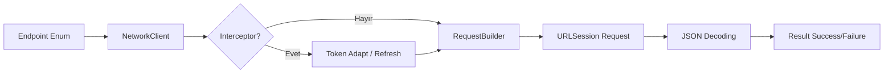
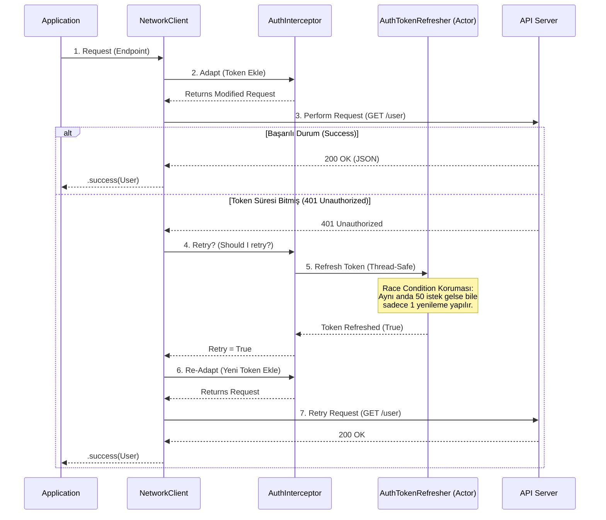

# CoreNetworking


<br>

## 📋 Gereksinimler (Requirements)

* iOS 15.0+ / macOS 12.0+ (Swift Concurrency desteği için)
* Swift 5.5+
* Xcode 13.0+

---

<br>

## 🛠 Özet Akış Şeması (Diagram)



---

<br>

**CoreNetworking**, modern Swift özelliklerini (Concurrency, Actors) temel alarak geliştirilmiş; hafif , güvenli (thread-safe) ve yüksek performanslı bir ağ katmanı kütüphanesidir.

Bu kütüphane, karmaşık ve yönetimi zor 3. parti bağımlılıklar (Alamofire vb.) yerine; native `URLSession` API'larını modern yazılım mimarisi prensipleriyle (SOLID, POP) birleştirerek sunar.

---

## 📑 İçindekiler (Table of Contents)

1. [Projenin Amacı ve Felsefesi](#-projenin-amacı-ve-felsefesi-philosophy)
2. [Teknik Özellikler](#-teknik-özellikler-features)
3. [Mimari ve Tasarım Desenleri](#-mimari-ve-tasarım-desenleri-architecture--design-patterns)
4. [Kullanılan Standartlar](#-kullanılan-standartlar-standards)
5. [Kurulum](#-kurulum-installation)
6. [Kullanım Kılavuzu](#-kullanım-kılavuzu-usage)
    - [Endpoint Tanımlama](#1-endpoint-tanımlama)
    - [İstek Atma (Request)](#2-i̇stek-atma-making-requests)
    - [Authentication & Token Yönetimi](#3-authentication--token-management)
7. [Gereksinimler](#-gereksinimler-requirements)
8. [Lisans](#-lisans-license)

---

---

## 🧠 Mühendislik Yaklaşımı: Sorular ve Çözümler (Engineering Decisions)

Bu kütüphaneyi geliştirirken kendimize sorduğumuz kritik sorular ve uyguladığımız mimari çözümler:

### Soru 1: "Aynı anda 50 istek 401 (Unauthorized) hatası alırsa ne olur?"
**Problem:** Klasik yapıda, 50 istek de aynı anda hata alır ve hepsi aynı anda "Token Yenileme" endpoint'ine saldırır. Sunucu bunu DDoS gibi algılayabilir veya token senkronizasyonu bozulur (ilk giden token alır, ikincisi onu geçersiz kılar).
<br>**Çözüm:** **Actor Model & Task Coalescing.** `AuthTokenRefresher` bir **Actor** olarak tasarlandı. İlk hata alan istek, yenileme işlemini başlatır. Arkadan gelen diğer 49 istek, yeni bir işlem başlatmaz; **devam eden işlemin (Task) sonucunu bekler.** Sonuç döndüğünde hepsi kaldığı yerden (yeni token ile) devam eder.

### Soru 2: "Kodumuz 3. parti kütüphanelere bağımlı olmalı mı?"
**Problem:** Alamofire gibi devasa kütüphaneler projeyi şişirir ve o kütüphanedeki bir değişiklik tüm projenizi etkiler.
<br>**Çözüm:** **Zero Dependency.** Sadece Apple'ın native `URLSession` API'larını kullandık. Bu sayede kütüphane hafif (lightweight) kaldı ve dışa bağımlılık riski sıfırlandı.

### Soru 3: "Token mantığını kütüphanenin içine mi gömmeliyiz?"
**Problem:** Her projenin token saklama yöntemi (Keychain, UserDefaults) farklıdır. Kütüphane buna karar verirse esnekliğini kaybeder.
<br>**Çözüm:** **Interceptor Pattern & Dependency Injection.** `RequestInterceptor` protokolü ile token ekleme (Adapt) ve yenileme (Retry) mantığını soyutladık. Geliştirici, token'ı nereden alacağını kütüphaneye dışarıdan (Inject) verir. Kütüphane sadece mekanizmayı yönetir, veriyi değil.

### Soru 4: "Bu kodu nasıl test edeceğiz?"
**Problem:** Doğrudan `URLSession` kullanan sınıfları test etmek zordur çünkü gerçek internet bağlantısı gerektirir.
<br>**Çözüm:** **Protocol Oriented Programming (POP).** `NetworkClient` sınıfı `NetworkClientProtocol`'e uyar. Test ortamında bu protokolü kullanan sahte (Mock) bir client oluşturarak internete çıkmadan tüm senaryoları test edebiliriz.

---

## 🏗 Mimari ve Veri Akışı (Architecture & Data Flow)

CoreNetworking, bir isteğin yaşam döngüsünü (Lifecycle) **Interceptor Pattern** ile yönetir.



---

## 📂 Proje Yapısı (Folder Structure)

Proje, **Single Responsibility Principle (SRP)** ilkesine sadık kalarak, modüler bir klasör yapısına sahiptir.

```plaintext
CoreNetworking
├── 📂 Core            # Temel yapı taşları (Enums, Errors)
│   ├── NetworkError.swift
│   ├── HTTPMethod.swift
│   └── EmptyResponse.swift
├── 📂 Encoding        # Veri kodlama stratejileri
│   ├── JSONEncoding.swift
│   ├── URLEncoding.swift
│   └── ParameterEncoding.swift
├── 📂 Interface       # Soyutlamalar (Protocols - POP)
│   ├── Endpoint.swift
│   ├── NetworkClientProtocol.swift
│   └── RequestInterceptor.swift
├── 📂 Interceptor     # Token ve Araya girme mantığı
│   ├── AuthenticationInterceptor.swift  # Token ekleme/yenileme mantığı
│   └── AuthTokenRefresher.swift         # Actor (Concurrency Manager)
└── 📂 Manager         # Ana yönetim katmanı
    ├── NetworkClient.swift              # İstekleri yöneten beyin
    └── RequestBuilder.swift             # URLRequest fabrikası
```

---

## 🎯 Projenin Amacı ve Felsefesi (Philosophy)

Bu projenin temel amacı, **Modern Swift Concurrency (Async/Await)** yapısını kullanarak, ağ isteklerini yönetirken karşılaşılan en büyük problemlerden biri olan **"Race Condition" (Yarış Durumu)** ve **Token Yönetimi** sorunlarını kökten çözmektir.

Klasik `completionHandler` yapılarının yarattığı "Callback Hell" sorununu ortadan kaldırır ve okunabilir, test edilebilir, sürdürülebilir bir yapı sunar.


---

## 🚀 Teknik Özellikler (Features)

* **Zero Dependency:** Hiçbir 3. parti kütüphane içermez. Tamamen native.
* **Thread-Safety:** `Actor` modeli ile %100 güvenli state yönetimi.
* **Automatic Token Refresh:** 401 hatalarını yakalar, token'ı yeniler ve isteği (kullanıcı hissetmeden) tekrar atar.
* **Task Coalescing:** Aynı anda 50 istek 401 hatası alsa bile, sunucuya sadece **1 adet** yenileme isteği gider. Diğerleri bekler ve sonucu kullanır.
* **Protocol Oriented:** Mocking ve Unit Test süreçleri için tamamen protokollere dayalıdır.
* **Type-Safe:** Generic yapılar ile derleme zamanında (compile-time) hata yakalama.

---

## 🏗 Mimari ve Tasarım Desenleri (Architecture & Design Patterns)

CoreNetworking geliştirilirken endüstri standardı tasarım desenleri kullanılmıştır.

| Tasarım Deseni (Pattern) | Kullanım Alanı ve Nedeni |
| :--- | :--- |
| **Interceptor Pattern** | `RequestInterceptor` protokolü ile istekler sunucuya gitmeden önce (Adapt) veya hata aldıktan sonra (Retry) araya girilir. |
| **Actor Model** | `AuthTokenRefresher` bir **Actor** olarak tasarlanmıştır. Bu, multi-threading ortamında veri bütünlüğünü korur. |
| **Builder Pattern** | `RequestBuilder`, karmaşık `URLRequest` konfigürasyonlarını (Header, Body, Method) adım adım oluşturur. |
| **Protocol-Oriented Programming** | Uygulama, somut sınıflara değil soyutlamalara bağımlıdır (Dependency Inversion). |
| **Singleton Pattern** | Token yenileme kuyruğunu tek bir merkezden (Actor) yönetmek için bilinçli tercih edilmiştir. |


---

## 📏 Kullanılan Standartlar (Standards)

* **SOLID Prensipleri:**
    * *Single Responsibility:* Her sınıf (Encoding, Client, Builder) tek bir işi yapar.
    * *Open/Closed:* Yeni Endpoint'ler eklenerek sistem genişletilebilir ancak çekirdek kod değişmez.
    * *Dependency Inversion:* `NetworkClient`, protokollere bağımlıdır.
* **Modern Concurrency:** Swift'in yerleşik `async/await` ve `Task` yapıları.
* **Result Type:** Hata yönetimi için Swift'in native `Result<T, NetworkError>` tipi.
* **SemVer:** Versiyonlama ve API kararlılığı için Semantic Versioning uyumluluğu.

---

## 📦 Kurulum (Installation)

### Swift Package Manager (SPM)

Projenize eklemek için `Package.swift` dosyanıza veya Xcode üzerinden şu adımları izleyin:

1.  Xcode'da **File > Add Packages** menüsünü açın.
2.  Depo URL'sini yapıştırın.
3.  **CoreNetworking** kütüphanesini seçin.

---

# 💻 CoreNetworking Kullanım Kılavuzu

Bu yapıyı projenize entegre etmek ve kullanmaya başlamak için temel olarak **3 adıma** ihtiyacınız var:

1.  **Model:** Sunucudan gelecek JSON verisini karşılayan `struct`.
2.  **Endpoint:** İsteğin nereye ve nasıl atılacağını tarif eden `enum` (Router).
3.  **Client:** İsteği yapan ve cevabı döndüren ana yönetici.

---

## 1. Adım: Veri Modelini Oluştur (Decodable)

Önce API'den dönecek olan JSON verisine uygun modelinizi oluşturun.

```swift
struct User: Decodable {
    let id: Int
    let name: String
    let email: String
}
```

---

## 2. Adım: Endpoint Tanımla (Router)

Kütüphanenin kalbi burasıdır. `Endpoint` protokolünü uygulayan bir `enum` oluşturarak API uçlarınızı merkezi bir yerden yönetin.

```swift
import CoreNetworking // Kendi modülünüzü import edin

enum UserEndpoint: Endpoint {
    case getUsers
    case getUserDetail(id: Int)
    case createUser(name: String, email: String)
    
    var baseURL: String {
        return "[https://jsonplaceholder.typicode.com](https://jsonplaceholder.typicode.com)"
    }

    var path: String {
        switch self {
        case .getUsers:
            return "/users"
        case .getUserDetail(let id):
            return "/users/\(id)"
        case .createUser:
            return "/users"
        }
    }
    
    var method: HTTPMethod {
        switch self {
        case .getUsers, .getUserDetail:
            return .get
        case .createUser:
            return .post
        }
    }
    
    // Parametreler ve Encoding
    var task: RequestTask {
        switch self {
        case .getUsers, .getUserDetail:
            return .requestPlain // Parametre gönderilmeyecek
            
        case .createUser(let name, let email):
            // Body (JSON) içinde veri göndermek için:
            let parameters: [String: Any] = [
                "name": name,
                "email": email
            ]
            return .requestParameters(parameters: parameters, encoding: JSONEncoding())
            
            // Eğer URL Query String (örn: ?search=test) gönderecekseniz:
            // return .requestParameters(parameters: params, encoding: URLEncoding())
        }
    }
    
    // Headers: İstek başlıkları
    var headers: [String : String]? {
        return ["Content-Type": "application/json"]
    }
}
```

---

## 3. Adım: Request Atma

Artık `NetworkClient` sınıfını kullanarak asenkron bir şekilde istek atabilirsiniz. Bunu bir `Service` sınıfı içinde şu şekilde yapabilirsiniz. (Örnek olarak)

```swift
class UserService {
    private let networkClient: NetworkClientProtocol
    
    init(networkClient: NetworkClientProtocol = NetworkClient()) {
        self.networkClient = networkClient
    }
    
    func fetchUsers() async {
        let result = await networkClient.request(UserEndpoint.getUsers, type: [User].self)
        
        switch result {
        case .success(let users):
            print("Kullanıcılar başarıyla geldi: \(users.count) adet")
            users.forEach { print("İsim: \($0.name)") }
            
        case .failure(let error):
            print("Bir hata oluştu: \(error.localizedDescription)")
        }
    }
}
```

---

Eğer API'niz Bearer Token kullanıyorsa, token sağlayıcıyı ve yenileme mekanizmasını (Interceptor) güvenli bir şekilde tanımlayabilirsiniz. Swift 6 uyumluluğu için closure'ların `@Sendable` olduğuna dikkat edin.

Eğer API'niz bir `Bearer Token` gerektiriyorsa ve token süresi dolduğunda (401 hatası) otomatik yenilenmesini istiyorsanız, kütüphanedeki `AuthenticationInterceptor` yapısını kullanın:


```swift
// 1. Token'ı sağla (Thread-safe closure)
let tokenProvider: @Sendable () -> String? = {
    return UserDefaults.standard.string(forKey: "accessToken")
}

// 2. Token yenileme mantığı (Async & Thread-safe)
let refreshAction: @Sendable () async -> Bool = {
    // Servise gidip yenileme yapın (Örnek: AuthManager üzerinden)
    return await AuthManager.shared.refreshToken()
}

// 3. Interceptor ve Client'ı oluştur
let authInterceptor = AuthenticationInterceptor(
    tokenProvider: tokenProvider,
    refreshAction: refreshAction
)

// Bu client artık her isteğe otomatik "Authorization" header ekler 
// ve 401 hatası aldığında sessizce refresh işlemini dener.
let secureClient = NetworkClient(interceptor: authInterceptor)
```

// ARTIK GÜVENDESİNİZ:
// 1. Bu client ile atılan her isteğe otomatik "Authorization: Bearer <token>" eklenir.
// 2. 401 hatası gelirse; istek havada yakalanır, token yenilenir ve istek tekrar atılır.
// 3. Sonsuz döngü koruması mevcuttur (Max Retry: 2).
---


<br>


### 4. İleri Seviye: Özel JSONDecoder Kullanımı

Eğer API'niz farklı tarih formatları (örn: ISO8601) veya `snake_case` kullanıyorsa, kendi decoder'ınızı enjekte edebilirsiniz:

```swift
let customDecoder = JSONDecoder()
customDecoder.keyDecodingStrategy = .convertFromSnakeCase
customDecoder.dateDecodingStrategy = .iso8601

// Decoder'ı client'a verin
let client = NetworkClient(decoder: customDecoder)
---

## 5. Boş Cevapları Karşılama (EmptyResponse)

Bazen API'den bir veri dönmez (örneğin sadece `204 No Content` veya `200 OK` dönen bir silme işlemi). Bu durumda kütüphanedeki `EmptyResponse` tipini kullanabilirsiniz:

```swift
func deleteUserAccount() async {
    let result = await networkClient.request(UserEndpoint.deleteUser, type: EmptyResponse.self)
    
    switch result {
    case .success:
        print("İşlem başarılı, dönen veri yok.")
    case .failure(let error):
        print("Silme işlemi başarısız: \(error)")
    }
}
```

<br>

## 📊 Özet Mimari Akış

Kütüphanenin çalışma prensibi şu zincirleme akışı takip eder:


1.  **Endpoint (Enum):** İsteğin tüm ham verilerini taşır.
2.  **NetworkClient:** İşlemi koordine eden ana motordur.
3.  **Interceptor (Opsiyonel):** İstek sunucuya gitmeden hemen önce araya girer (Adapt) ve hata dönerse müdahale eder (Retry).
4.  **RequestBuilder:** `Endpoint` verisini `URLRequest` objesine dönüştürür.
5.  **URLSession:** Native Swift motoru ile isteği gerçekleştirir.
6.  **Decoding:** Gelen veri `Decodable` ile belirttiğiniz tipe çevrilir ve size döner.


<br> <br>


> **Sonuç:** Bu yapı sayesinde projenin hiçbir yerinde `URLRequest` konfigürasyonuyla uğraşmazsın. Sadece neyi (`Endpoint`) ve hangi tipe (`Decodable`) çekmek istediğini söylersin, kütüphane tüm karmaşıklığı arka planda halleder.


## 📄 Lisans (License)

CoreNetworking, MIT Lisansı altında sunulmaktadır.
Detaylar için LICENSE dosyasına bakabilirsiniz.

Copyright (c) 2025 **UGUR HAMZAOGLU**
