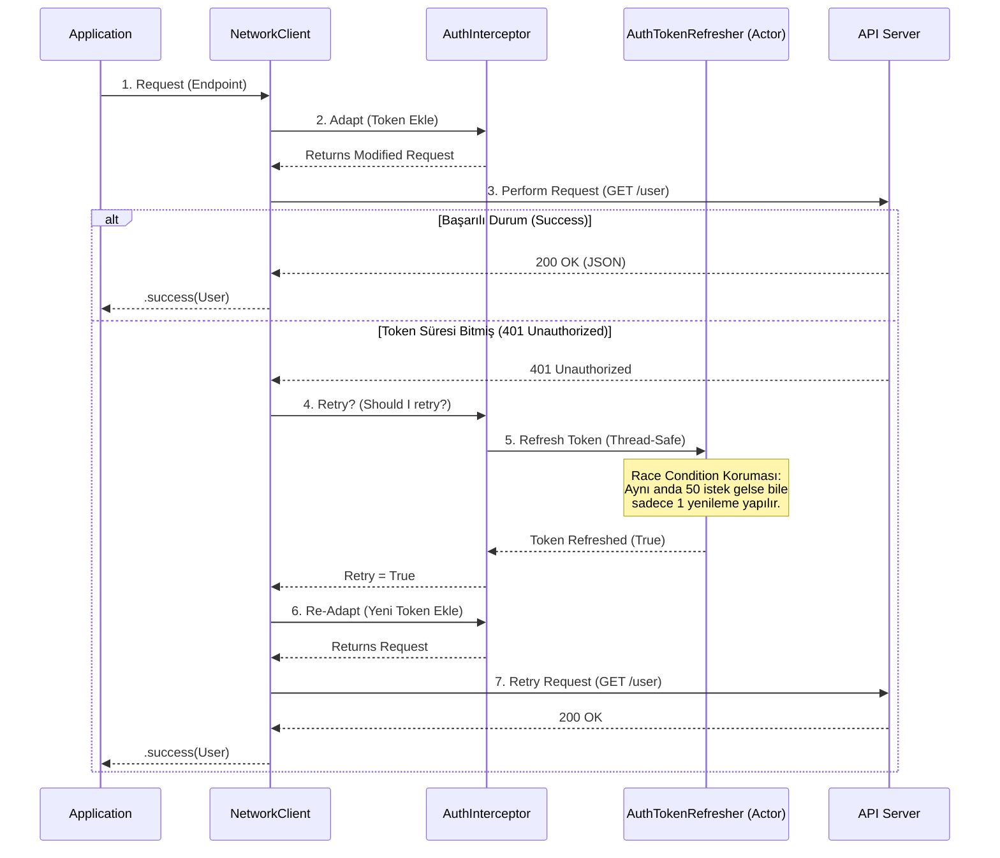

# CoreNetworking


<br>

## 📋 Gereksinimler (Requirements)

* iOS 15.0+ / macOS 12.0+ (Swift Concurrency desteği için)
* Swift 5.5+
* Xcode 13.0+

---

**CoreNetworking**, modern Swift özelliklerini (Concurrency, Actors) temel alarak geliştirilmiş; hafif , güvenli (thread-safe) ve yüksek performanslı bir ağ katmanı kütüphanesidir.

Bu kütüphane, karmaşık ve yönetimi zor 3. parti bağımlılıklar (Alamofire vb.) yerine; native `URLSession` API'larını modern yazılım mimarisi prensipleriyle (SOLID, POP) birleştirerek sunar.

---

## 📑 İçindekiler (Table of Contents)

1. [Projenin Amacı ve Felsefesi](#-projenin-amacı-ve-felsefesi-philosophy)
2. [Teknik Özellikler](#-teknik-özellikler-features)
3. [Mimari ve Tasarım Desenleri](#-mimari-ve-tasarım-desenleri-architecture--design-patterns)
4. [Kullanılan Standartlar](#-kullanılan-standartlar-standards)
5. [Kurulum](#-kurulum-installation)
6. [Kullanım Kılavuzu](#-kullanım-kılavuzu-usage)
    - [Endpoint Tanımlama](#1-endpoint-tanımlama)
    - [İstek Atma (Request)](#2-i̇stek-atma-making-requests)
    - [Authentication & Token Yönetimi](#3-authentication--token-management)
7. [Gereksinimler](#-gereksinimler-requirements)
8. [Lisans](#-lisans-license)

---

---

## 🧠 Mühendislik Yaklaşımı: Sorular ve Çözümler (Engineering Decisions)

Bu kütüphaneyi geliştirirken kendimize sorduğumuz kritik sorular ve uyguladığımız mimari çözümler:

### Soru 1: "Aynı anda 50 istek 401 (Unauthorized) hatası alırsa ne olur?"
**Problem:** Klasik yapıda, 50 istek de aynı anda hata alır ve hepsi aynı anda "Token Yenileme" endpoint'ine saldırır. Sunucu bunu DDoS gibi algılayabilir veya token senkronizasyonu bozulur (ilk giden token alır, ikincisi onu geçersiz kılar).
<br>**Çözüm:** **Actor Model & Task Coalescing.** `AuthTokenRefresher` bir **Actor** olarak tasarlandı. İlk hata alan istek, yenileme işlemini başlatır. Arkadan gelen diğer 49 istek, yeni bir işlem başlatmaz; **devam eden işlemin (Task) sonucunu bekler.** Sonuç döndüğünde hepsi kaldığı yerden (yeni token ile) devam eder.

### Soru 2: "Kodumuz 3. parti kütüphanelere bağımlı olmalı mı?"
**Problem:** Alamofire gibi devasa kütüphaneler projeyi şişirir ve o kütüphanedeki bir değişiklik tüm projenizi etkiler.
<br>**Çözüm:** **Zero Dependency.** Sadece Apple'ın native `URLSession` API'larını kullandık. Bu sayede kütüphane hafif (lightweight) kaldı ve dışa bağımlılık riski sıfırlandı.

### Soru 3: "Token mantığını kütüphanenin içine mi gömmeliyiz?"
**Problem:** Her projenin token saklama yöntemi (Keychain, UserDefaults) farklıdır. Kütüphane buna karar verirse esnekliğini kaybeder.
<br>**Çözüm:** **Interceptor Pattern & Dependency Injection.** `RequestInterceptor` protokolü ile token ekleme (Adapt) ve yenileme (Retry) mantığını soyutladık. Geliştirici, token'ı nereden alacağını kütüphaneye dışarıdan (Inject) verir. Kütüphane sadece mekanizmayı yönetir, veriyi değil.

### Soru 4: "Bu kodu nasıl test edeceğiz?"
**Problem:** Doğrudan `URLSession` kullanan sınıfları test etmek zordur çünkü gerçek internet bağlantısı gerektirir.
<br>**Çözüm:** **Protocol Oriented Programming (POP).** `NetworkClient` sınıfı `NetworkClientProtocol`'e uyar. Test ortamında bu protokolü kullanan sahte (Mock) bir client oluşturarak internete çıkmadan tüm senaryoları test edebiliriz.

---

## 🏗 Mimari ve Veri Akışı (Architecture & Data Flow)

CoreNetworking, bir isteğin yaşam döngüsünü (Lifecycle) **Interceptor Pattern** ile yönetir.



---

## 📂 Proje Yapısı (Folder Structure)

Proje, **Single Responsibility Principle (SRP)** ilkesine sadık kalarak, modüler bir klasör yapısına sahiptir.

```plaintext
CoreNetworking
├── 📂 Core            # Temel yapı taşları (Enums, Errors)
│   ├── NetworkError.swift
│   ├── HTTPMethod.swift
│   └── EmptyResponse.swift
├── 📂 Encoding        # Veri kodlama stratejileri
│   ├── JSONEncoding.swift
│   ├── URLEncoding.swift
│   └── ParameterEncoding.swift
├── 📂 Interface       # Soyutlamalar (Protocols - POP)
│   ├── Endpoint.swift
│   ├── NetworkClientProtocol.swift
│   └── RequestInterceptor.swift
├── 📂 Interceptor     # Token ve Araya girme mantığı
│   ├── AuthenticationInterceptor.swift  # Token ekleme/yenileme mantığı
│   └── AuthTokenRefresher.swift         # Actor (Concurrency Manager)
└── 📂 Manager         # Ana yönetim katmanı
    ├── NetworkClient.swift              # İstekleri yöneten beyin
    └── RequestBuilder.swift             # URLRequest fabrikası
```

---

## 🎯 Projenin Amacı ve Felsefesi (Philosophy)

Bu projenin temel amacı, **Modern Swift Concurrency (Async/Await)** yapısını kullanarak, ağ isteklerini yönetirken karşılaşılan en büyük problemlerden biri olan **"Race Condition" (Yarış Durumu)** ve **Token Yönetimi** sorunlarını kökten çözmektir.

Klasik `completionHandler` yapılarının yarattığı "Callback Hell" sorununu ortadan kaldırır ve okunabilir, test edilebilir, sürdürülebilir bir yapı sunar.


---

## 🚀 Teknik Özellikler (Features)

* **Zero Dependency:** Hiçbir 3. parti kütüphane içermez. Tamamen native.
* **Thread-Safety:** `Actor` modeli ile %100 güvenli state yönetimi.
* **Automatic Token Refresh:** 401 hatalarını yakalar, token'ı yeniler ve isteği (kullanıcı hissetmeden) tekrar atar.
* **Task Coalescing:** Aynı anda 50 istek 401 hatası alsa bile, sunucuya sadece **1 adet** yenileme isteği gider. Diğerleri bekler ve sonucu kullanır.
* **Protocol Oriented:** Mocking ve Unit Test süreçleri için tamamen protokollere dayalıdır.
* **Type-Safe:** Generic yapılar ile derleme zamanında (compile-time) hata yakalama.

---

## 🏗 Mimari ve Tasarım Desenleri (Architecture & Design Patterns)

CoreNetworking geliştirilirken endüstri standardı tasarım desenleri kullanılmıştır.

| Tasarım Deseni (Pattern) | Kullanım Alanı ve Nedeni |
| :--- | :--- |
| **Interceptor Pattern** | `RequestInterceptor` protokolü ile istekler sunucuya gitmeden önce (Adapt) veya hata aldıktan sonra (Retry) araya girilir. |
| **Actor Model** | `AuthTokenRefresher` bir **Actor** olarak tasarlanmıştır. Bu, multi-threading ortamında veri bütünlüğünü korur. |
| **Builder Pattern** | `RequestBuilder`, karmaşık `URLRequest` konfigürasyonlarını (Header, Body, Method) adım adım oluşturur. |
| **Protocol-Oriented Programming** | Uygulama, somut sınıflara değil soyutlamalara bağımlıdır (Dependency Inversion). |
| **Singleton Pattern** | Token yenileme kuyruğunu tek bir merkezden (Actor) yönetmek için bilinçli tercih edilmiştir. |


---

## 📏 Kullanılan Standartlar (Standards)

* **SOLID Prensipleri:**
    * *Single Responsibility:* Her sınıf (Encoding, Client, Builder) tek bir işi yapar.
    * *Open/Closed:* Yeni Endpoint'ler eklenerek sistem genişletilebilir ancak çekirdek kod değişmez.
    * *Dependency Inversion:* `NetworkClient`, protokollere bağımlıdır.
* **Modern Concurrency:** Swift'in yerleşik `async/await` ve `Task` yapıları.
* **Result Type:** Hata yönetimi için Swift'in native `Result<T, NetworkError>` tipi.
* **SemVer:** Versiyonlama ve API kararlılığı için Semantic Versioning uyumluluğu.

---

## 📦 Kurulum (Installation)

### Swift Package Manager (SPM)

Projenize eklemek için `Package.swift` dosyanıza veya Xcode üzerinden şu adımları izleyin:

1.  Xcode'da **File > Add Packages** menüsünü açın.
2.  Depo URL'sini yapıştırın.
3.  **CoreNetworking** kütüphanesini seçin.

---

## 💻 Kullanım Kılavuzu (Usage)

### 1. Endpoint Tanımlama

API isteklerinizi organize etmek için `Endpoint` protokolünü kullanın.

```swift
import CoreNetworking

enum RickAndMortyEndpoint: Endpoint {
    case characters
    case location(id: Int)

    var baseURL: String { "[https://rickandmortyapi.com/api](https://rickandmortyapi.com/api)" }
    
    var path: String {
        switch self {
        case .characters: return "/character"
        case .location(let id): return "/location/\(id)"
        }
    }
    
    var method: HTTPMethod { .get }
    var task: RequestTask { .requestPlain } 
    var headers: [String : String]? { nil }
}
```

### 2. İstek Atma (Making Requests)

Tek satırda, tip güvenli istek atın.

```swift
// Veri Modeli
struct CharacterResponse: Decodable {
    let results: [Character]
}

// Kullanım
let client = NetworkClient()

func fetch() async {
    let result = await client.request(RickAndMortyEndpoint.characters, type: CharacterResponse.self)
    
    switch result {
    case .success(let response):
        print("Karakterler geldi: \(response.results.count)")
    case .failure(let error):
        print("Hata: \(error)")
    }
}
```

### 3. Authentication & Token Management

Token sağlayıcınızı ve yenileme fonksiyonunuzu inject edin.

```swift
// Token yenileme mantığı
let authInterceptor = AuthenticationInterceptor(
    tokenProvider: { 
        return UserDefaults.standard.string(forKey: "accessToken") 
    },
    refreshAction: {
        // Token yenileme isteği at (Bool döner)
        return await AuthManager.shared.refreshToken()
    }
)

// Client'a interceptor'ı verin
let secureClient = NetworkClient(interceptor: authInterceptor)

// Bu client ile atılan isteklerde:
// 1. Header'a otomatik "Bearer <token>" eklenir.
// 2. 401 hatası gelirse token yenilenir ve istek tekrar denenir.
```

---


## 📄 Lisans (License)

CoreNetworking, MIT Lisansı altında sunulmaktadır.
Detaylar için LICENSE dosyasına bakabilirsiniz.

Copyright (c) 2025 **UGUR HAMZAOGLU**
